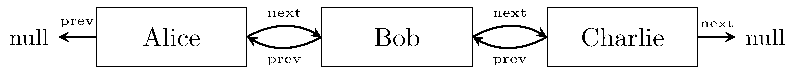

# CS2440 Midterm 2: CPU Process Scheduling System

## Introduction

You've been hired by an operating system company to implement a CPU process scheduler. The scheduler uses a circular doubly-linked list to manage processes in a **round-robin** fashion. In round-robin scheduling, each process gets a fixed time slice to use the CPU, and then the scheduler moves to the next process. After the last process has had its turn, the scheduler automatically returns to the first process, continuing in a circular manner. This ensures fair CPU time distribution among all processes.

The scheduler also allows processes to be temporarily suspended (when waiting for I/O, for example) and later resumed efficiently.

In order to implement such a scheduler, we will build several classes step-by-step:

- A generic class `DoublyNode<T>`, very similar to the `Node<T>` class seen in class, but with links to both a next and a previous node. These nodes thus help building linked lists in which we can navigate in both directions.
- A generic class `CDLL<T>` (Circular Doubly Linked List) that will be the core of our scheduler. A CDLL is exactly like the circular linked lists seen in homework, but in which we can navigate both clockwise and counter-clockwise. Additionally, it maintains a structure that allows us to temporarily remove nodes and later re-insert them in O(1) time.
- A class `Process` representing a running process with a process ID, name, and remaining CPU time,
- A class `CPUScheduler` that uses the CDLL to schedule process execution in round-robin fashion.

More detail for each class will be given as we go.

---

## Part 1: Doubly Linked Node

**1.** You are familiar with the `Node` class from a singly-linked list:

```java
public class Node<T> {
    private T data;
    private Node<T> next;
    
    public Node(T data, Node<T> next) {
        this.data = data;
        this.next = next;
    }
    
    public T getData() { 
        return data; 
    }

    public Node<T> getNext() { 
        return next; 
    }

    public void setNext(Node<T> next) { 
        this.next = next; 
    }
}
```

Write a generic class `DoublyNode<T>` that extends this concept by adding a `prev` field that references a previous node. Your class should have:
- Three private fields: `data` (type `T`), `next` (type `DoublyNode<T>`), and `prev` (type `DoublyNode<T>`),
- A constructor that takes all three values as arguments,
- A constructor that takes only `data` and initializes `next` and `prev` to `null`,
- Getters and setters for all three fields.

---

**2.** Consider the following code:

```java
DoublyNode<String> n1 = new DoublyNode<>("Alice", null, null);
DoublyNode<String> n2 = new DoublyNode<>("Bob", null, n1);
DoublyNode<String> n3 = new DoublyNode<>("Charlie", null, n2);
```

It is perfectly valid Java code. However, it creates a chain of nodes that are not fully linked in both directions. Add the necessary statements after each node creation to properly link the nodes together in both directions so that we end up with the following picture in memory:



---

**3.** After the code from question 2 is completed correctly, what will the following expressions evaluate to? Write your answers.

(a) `n1.getNext().getData()`  
(b) `n3.getPrev().getData()`  
(c) `n2.getNext().getPrev().getData()`  
(d) `n1.getPrev()` 

---

**4.** Consider the following mystery method:

```java
public static <T> boolean mystery(DoublyNode<T> node) {
    if (node == null) {
        return true;
    }
    
    return (node.getPrev() == null || node.getPrev().getNext() == node) 
        && (node.getNext() == null || node.getNext().getPrev() == node);
}
```

What does this method do? What would be a better name for it? In what situation would it return `false`?

---

## Part 2: Circular Doubly Linked List

**Introduction to Part 2:**

A Circular Doubly Linked List (CDLL) is a data structure that can function like a queue, where elements are processed in FIFO (First-In-First-Out) order. However, it has two special features: 

1. the tail is linked back to the head to create a circular structure (thus allowing smooth rotation through the elements of the queue), and

2. we can **temporarily remove** elements from the middle of the list and later **re-insert** them back in their original position very efficiently (in O(1) time). This is useful for our CPU scheduler, where processes may need to pause (while waiting for I/O) and later resume exactly where they left off in the scheduling order.

---

We are going to build the `CDLL<T>` around our previously defined `DoublyNode<T>` class. The circular structure of our CDLL will look like this:


Removing P4, for example, results in something like this:


The circular structure, when starting from `head`, now avoids P4 completely. But P4 is still *dangling* off of the CDLL, with its `next` and `prev` fields intact. So, readding P4 back into the list is possible as long as we have access to that node. For that purpose, our class `CDLL<T>` will maintain a stack of `DoublyNode<T>` containing the deleted nodes.

**5.** Write the skeleton of a generic class `CDLL<T>`. It should have:
- Two private fields: `DoublyNode<T> head` and `Stack<DoublyNode<T>> deleted`
- A constructor that takes a single parameter of type `T` (the data for the initial node)
- A constructor that takes no argument at all and make an empty CDLL, namely with a null `head`
- Both constructors should initialize the `deleted` stack to an empty stack
- **Important**: In a circular list with one node, that node's `next` and `prev` should point to itself

---

**6.** Write a method `isEmpty()` that returns `true` if the circular list is empty, and `false` otherwise.

---

**7.** We want to add a `size()` method that returns the number of nodes in the circular list. In our example above, it would return `5` before removing P4 and `4` after removing P4. Here's an attempt at it:

```java
public int size() {
    if (isEmpty()) {
        return 0;
    }
    
    int count = 0;
    DoublyNode<T> current = head;
    while (current != head) {
        count++;
        current = current.getNext();
    }
    return count;
}
```

It has a critical bug. Identify it and fix it.

---

**8.** Implement the method `add(T data)` that adds a new element to the circular list. This should add a new node  containing `data` **just before** the `head` node. If the CDLL is empty, the new node should become the new head. In our example above, adding a node P6 would result in a CDLL where P6 is in between P5 and P1, the head remaining at P1.

---

**9.** Consider a CDLL that currently contains three processes in order: "Browser" → "Editor" → "Compiler" (with head pointing to "Browser"). After calling `add("Mail")`, what is the order of processes in the circular list, starting from head? 

---

**10.** What is the time complexity of the `add(T data)` method, as a function of the size of the CDLL? Justify.

---

**11.** How does it compare, complexity-wise, to adding an element to the end of a simple linked (circular or not) list? Explain.

---

**12.** Here is a method:

```java
public void mystery(DoublyNode<T> node) {
    if (node != null) {
        node.getPrev().setNext(node.getNext());
        node.getNext().setPrev(node.getPrev());
    }
}
```

What does this method do? What would be a good name for it? 

---

**13.** Implement the method `delete(T elt)` that searches for the first occurrence of `elt` in the circular list. The method should:
- Search through the CDLL, from `head`, for a node whose data equals `elt`.
- If found, remove the node (in the style of the deletion of P4 in our example above) from the circular list and push it on the `deleted` stack. If the node being deleted is the `head`, update `head` to point to the next node in the CDLL.
- If not found, return `null`.

**Special case**: If there's only one node in the list and it's deleted, the CDLL becomes empty. (But its `deleted` stack will still contain the newly deleted node.)

---

**14.** The goal of the `reAddLastDeleted()` method is to take the most recently deleted node from the stack and re-insert it back into the CDLL. Here is a skeleton for that method:

```java
public void reAddLastDeleted() {
    if (deleted.isEmpty()) {
        throw new IllegalStateException("No deleted nodes to re-add");
    }

    DoublyNode<T> node = deleted.pop();
    
    // Re-insert the node
    node.???;
    node.???;
    
    // If the CDLL was empty, set the new head to be this node 
    if (isEmpty()) {
        ???;
    }
}
```

Complete the method.

---

**15.** What is the complexity of this `reAddLastDeleted()` method, as a function of the size of the CDLL? Justify your answer.

---

**16.** Consider our example CDLL above, name it `example`, and then perform these operations in sequence:

```java
example.delete(P2);
example.delete(P4);
example.reAddLastDeleted();
example.reAddLastDeleted();
```

(a) After `delete(P2)`, what is P2's `next`? What is P2's `prev`?

(b) After the first `reAddLastDeleted()`, which node gets re-added? What is the order of nodes in the circular list at that point, starting from the head?

(c) After both `reAddLastDeleted()` calls, what is the final order of nodes in the circular list, starting from the head?

---

**17.** Could we have used a queue instead of a stack for the `deleted` field? Explain your answer.

---

**18.** Implement a method `rotate()` that moves the `head` pointer to the next node in the circular list. What is the time complexity of this operation?

---

**19.** We want to make our CDLL class iterable. Add the necessary code to the signature of the class and implement the `iterator()` method. The following code:
```java
CDLL<String> cdll = new CDLL<>();
for(int i = 1; i <= 5; i++) {
    cdll.add("P" + i);
}
cdll.delete("P4");  
cdll.rotate();              
for (String processName : cdll) {
    System.out.println(processName);
}

```
should print:
```
P2
P3
P5
P1
```

## Part 3: Process

**Introduction to Part 3:**

Now that we have our CDLL data structure, we need to define what data it will hold when used as a process scheduler. A `Process` represents a running program that needs CPU time. Each process has a unique process identifier (PID), a name, and an amount of CPU time it still needs to complete its work.

---

**20.** Write a class `Process` with the following private fields:
- `int pid` (process ID)
- `String name` (process name)
- `int timeRemaining` (CPU time units still needed)

Write a constructor that takes all three values as arguments and initializes the fields. Add getter methods for all fields.

---

**21.** Implement what's needed for the following code:

```java
System.out.println(new Process(1, "WebBrowser", 100));
```

to print:

```
Process[pid=1, name=WebBrowser, timeRemaining=100]
```

---

**22.** Implement an `equals(Object obj)` method. Two processes should be considered equal if they have the same PID. 

---

**23.** Add a method `executeTimeSlice(int timeSlice)` that simulates giving this process some CPU time. The method should update `timeRemaining` by subtracting `timeSlice`. If the CPU time given to the process exceeds the time required for the process to finish, then the new remaining time is simply zero.

---

**24.** Implement a method `isFinished()` that returns `true` if the process has completed its work (no remaining time needed).

---

## Part 4: CPUScheduler

**Introduction to Part 4:**

Now we bring everything together. The `CPUScheduler` class uses a `CDLL<Process>` to implement round-robin scheduling. Processes take turns executing, and the scheduler can suspend processes that need to wait (for I/O operations) and later resume them.

Here is a skeleton of the `CPUScheduler` class with only the signatures of its methods:
```java
public class CPUScheduler {
    private CDLL<Process> processes;
    private int timeSlice;

    public CPUScheduler(int timeSlice);

    public void addProcess(Process p);

    public Process getCurrentProcess();

    public void runTimeSlice(); 

    public void suspendCurrent();

    public void resumeLast();

    public void printActiveProcesses();

    public void simulate(int totalTime);
}
```

---

**25.**  Write the constructor for the `CPUScheduler` class. It should initialize its `timeSlice` to the given parameter and create an empty CDLL for `processes`.

---

**26.** Implement a method `addProcess(Process p)` that adds a new process to the scheduler. This method should simply add the process to the CDLL.

---

**27.** The method `getCurrentProcess()` must returns the current process (the one at the head of the CDLL). Note that the CDLL class does not have a `peek()` method. Can you find a way to implement `getCurrentProcess()` without modifying the CDLL class? Hint: use the iterator of the CDLL `processes`.

---

**28.** The method `runTimeSlice()` must retrieve the current process, simulate executing it for one time slice, and then move on to the next process in line. (That's the round-robin part.) If the current process finishes its work, it should be deleted from the CDLL. 

Here is a skeleton for the method:
```java
public void runTimeSlice() {
    Process current = ????;
    if (current == null) {
        System.out.println("No processes to run");
        return;
    }

    System.out.println("Running " + current.getName() + " (pid=" + current.getPid() + ")");
    current.???;

    if (current.isFinished()) {
        System.out.println(current.getName() + " finished!");
        ???;
    } else {
        // Move to next process (round-robin)
        ???;
    }
}
```
Complete it.

---

**29.** Implement two methods:
- `suspendCurrent()`: temporarily removes the current process from the CDLL
- `resumeLast()`: re-adds the most recently suspended process back to the scheduler

Both methods should use the appropriate CDLL methods you implemented earlier.

---

**30.**  Implement `printActiveProcesses()` that prints information about all active (i.e., not currently suspended) processes.

---

**31.** BONUS. Implement the `simulate(int totalTime)` method that runs the scheduler for a total amount of `totalTime` time units. It should repeatedly call `runTimeSlice()` until either all processes are finished or the total time has been reached.

---

**32.**  BONUS. There is one major design flaw in the current `CPUScheduler`. Can you find it? Explain how you would fix it. Hint: think about what happens if an active process P1 finishes while some other process P2 is suspended, and then P2 is resumed.